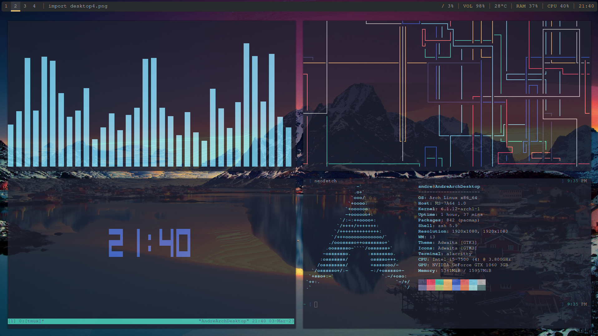
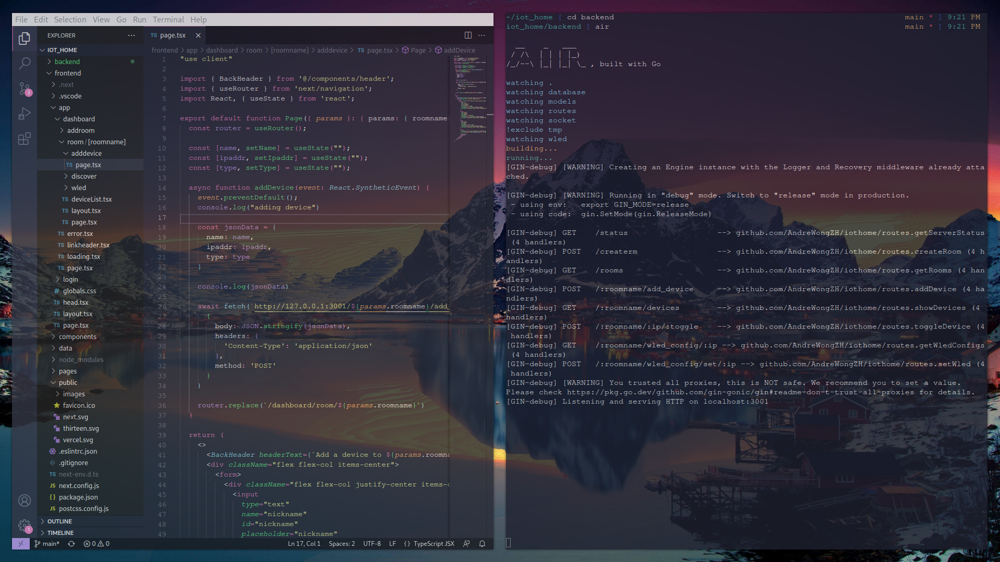

# archlinux_dotfiles




Modifications:

- Shell: zsh
- windows manager: i3wm
- window switcher: rofi
- editor: neovim and vscode
- terminal: alacritty
- multiplexer: tmux
- monitor: htop and polybar
- compositor: picom
- browser: firefox

other repo used:

- [alacritty-theme](https://github.com/alacritty/alacritty-theme)
- [rofi theme](https://github.com/adi1090x/rofi)
- [gurb2-themes](https://github.com/vinceliuice/grub2-themes)

Programs used
- [pipes.sh](https://github.com/pipeseroni/pipes.sh)
- [cava](https://github.com/karlstav/cava)
- [cbonsai](https://gitlab.com/jallbrit/cbonsai)

## Steps to install archlinux

1. create bootable USB drive from using the archlinux iso file from their website
2. Boot into archlinux live in UEFI mode
    can verify boot mode by running this line
    ```
    ls /sys/firmware/efi/efivars
    ```
3. Update the system clock
   ```
   timedatectl set-timezone Singapore
   timedatectl status
   ```
4. Using `fdisk`, create 300MB of space for EFI system partition and the rest of the space for the root partition
5. format the root partition
    ```
    mkfs.ext4 /dev/[root partition]
    ```
6. format the efi partition
    ```
    mkfs.fat -F 32 /dev/[efi partition]
    ```
7. mount the file systems
   ```
   mount /dev/[root partition] /mnt
   mount --mkdir /dev/[efi partition] /mnt/boot
   ```
8. install essential packages using pacman
   ```
   pacstrap -K /mnt base linux linux-firmware neovim
   ```
9. generate fstab file
   ```
   genfstab -U /mnt >> /mnt/etc/fstab
   ```
10. change root into archlinux system
    ```
    arch-chroot /mnt
    ```
11. set timezone
    ```
    ln -sf /usr/share/zoneinfo/Asia/Singapore /etc/localtime
    hwclock --systohc

    # use local time for archlinux so it does not interfer with windows
    timedatectl set-local-rtc 1
    ```
12. localization
    ```
    locale-gen

    vim /etc/locale.conf
    # add text below
    LANG=en_US.UTF-8
    ```
13. create hostname
    ```
    vim /etc/hostname
    # add hostname inside
    ```
14. set root password
    ```
    passwd
    ```
15. install and configure bootloader (using grub)
    ```
    # install packages
    pacman -S gurb efibootmgr

    # using --removable here because UEFI firmware doesnt detect the boot correctly without it
    # referenced solution in https://bbs.archlinux.org/viewtopic.php?id=250928
    grub-install --target=x86_64-efi --efi-directory=/boot --bootloader-id=GRUB --removable

    # install package
    pacman -S os-prober

    # uncomment line below in /etc/default/grub
    GRUB_DISABLE_OS_PROBER=false

    # generate grub.cfg file and add archlinux OS to boot
    grub-mkconfig -o /boot/grub/grub.cfg

    # os-prober doesnt detect windows boot manager so i manually added in an entry to grub which points to bootmgfw.efi
    # add to /etc/grub.d/40_custom
    # replace (hd3,gpt3) with the disk number and partition number that points to windows boot manager
    menuentry "Windows boot manager" {
        insmod part_gpt
        insmod chain
        set root='(hd3,gpt3)'
        chainloader /EFI/Microsoft/Boot/bootmgfw.efi
    }

    ```
16. Install networkmanger and dhcpcd (i only need ethernet)
    ```
    pacman -S dhcpcd networkmanager

    systemctl enable NetworkManager.service
    systemctl enable dhcp.service
    ```
17. Create user and give sudo rights
    ```
    pacman -S sudo

    useradd -G wheel -m andre
    passwd andre

    visudo
    # uncomment out the line below
    %wheel ALL=(ALL:ALL) ALL
    ```
18. Install nvidia drivers (currently using Nvidia GTX 1060)
    ```
    sudo pacman -S xf86-video-nouveau mesa
    ```
19. Install desktop env and/or window managers
    ```
    sudo pacman -S xorg-server xorg-xinit xorg-apps

    # for installing gnome
    sudo pacman -S gnome
    sudo systemctl start gdm.service

    # for installing i3wm
    sudo pacman -S i3-wm i3lock i3status xss-lock dex network-manager-applet
    ```
20. Install programs
    ```
    sudo pacman -S firefox neofetch picom polybar rofi tmux alacritty feh htop zsh git
    ```
21. Copy dot files into .config
    ```
    copy in .config folders for settings such as alacritty i3 picom polybar and rofi
    copy .xinitrc and .zshrc into home directory
    ```
22. Install AUR installer
    ```
    sudo pacman -S --needed git base-devel
    git clone https://aur.archlinux.org/yay-bin.git
    cd yay-bin
    makepkg -si

    yay -Y --gendb
    yay -Syu --devel
    yay -Y --devel --save
    ```
23. Install good to have programs
    ```
    sudo pacman -S telegram-desktop
    ```

